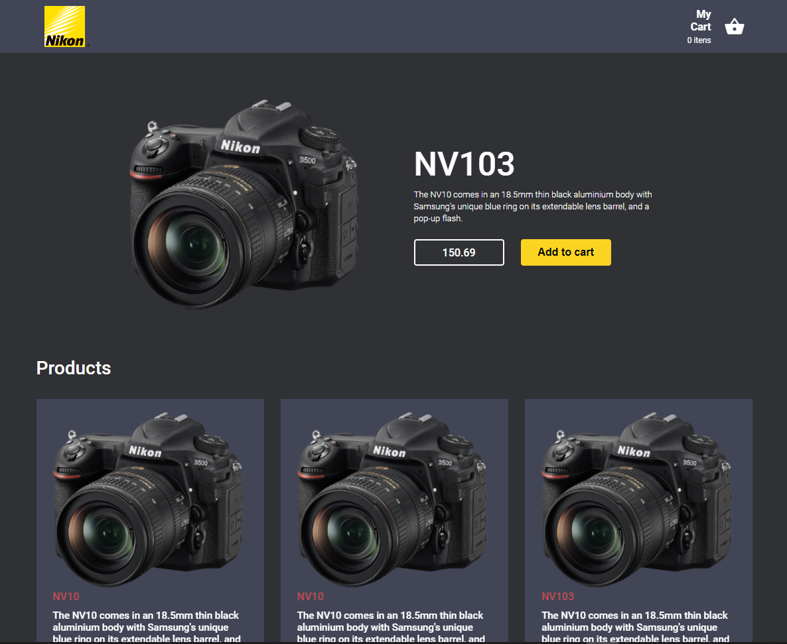
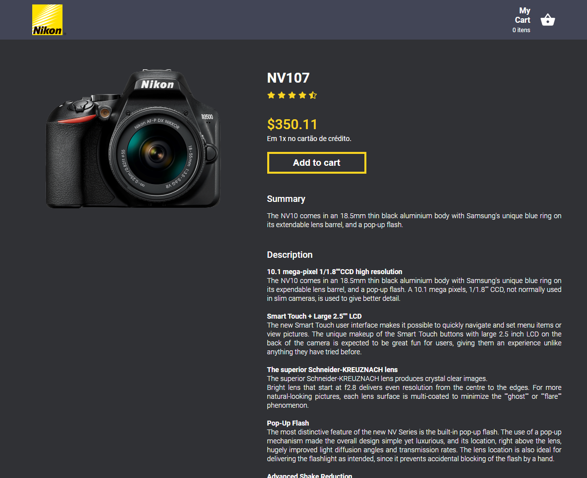
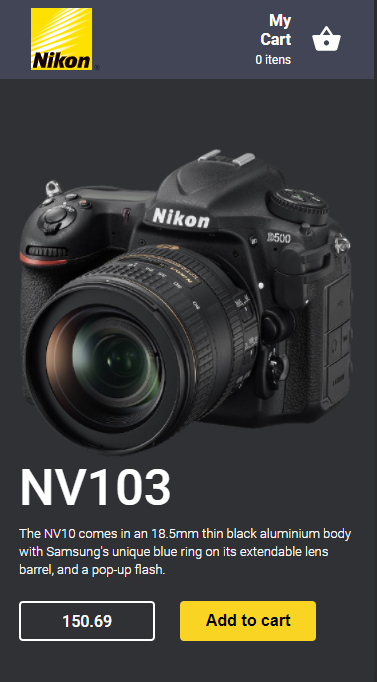
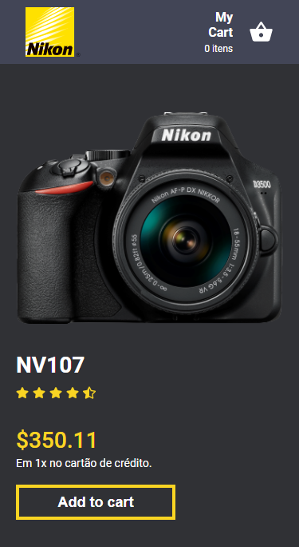

# E-commerce web

> [WIP] Project build in React JS, scss, hooks, redux and axios.

> [WIP] Projeto desenvolvido com React JS, scss, hooks, redux e axios.

<div align="center" styles="flex-direction: row;">
  
  
  
  
</div>

## Installation

- Clone repo: `https://github.com/gaiotto1/nikon-shopp`
- Install dependencies: `yarn` or `npm install`


To run the project:
```sh
yarn start
```

## Release History

* 1.0.0
    * Work in progress

## Meta

Julio – juliogaiotto10@gmail.com

Distributed under the MIT license. See ``LICENSE`` for more information.
